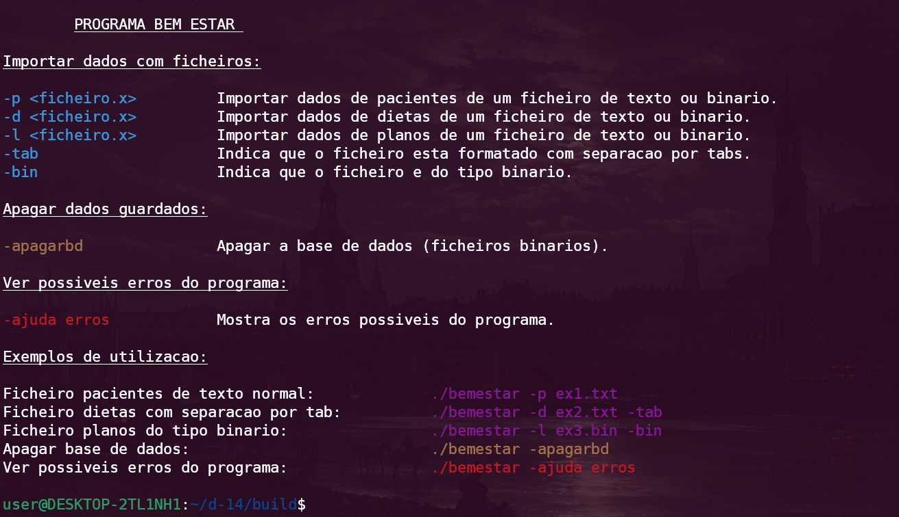
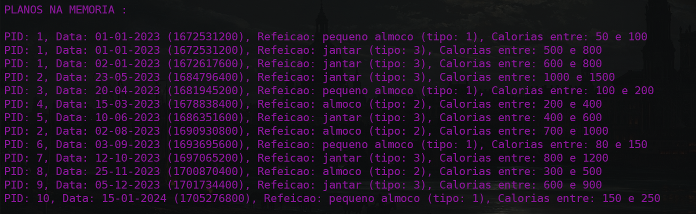

# Trabalho Prático

## Descrição

Licenciatura em Engenharia de Sistemas Informáticos 2023-24

Laboratórios de Informática e Programação Imperativa

O programa visa apoiar o bem-estar e cuidados nutricionais, abordando o problema do comportamento alimentar saudável. Funcionalidades incluem carregamento de dados de pacientes, dietas e planos nutricionais, apresentação de estatísticas de calorias, listagem de pacientes com comportamento fora do plano nutricional e análises diversas. Desenvolvido com base em métodos rigorosos de análise de problemas e as melhores práticas de programação imperativa em C.

A documentação do programa gerada pelo Doxygen está disponível em `doc/v1.0/Programa/latex/d-14-refman.pdf`; a documentação/relatório do programa está disponível em `doc/v1.0/Programa/latex/d-14-doc.pdf` e a documentação da biblioteca está disponível em `doc/v1.0/Biblioteca/latex/manual_biblioteca.pdf`.

O código da solução está disponível na pasta `src`. A pasta `src/LESI_PI_TP_a28602/` contém o código do programa e a pasta `src/GestorDadosIO/` contém o código da biblioteca de input e output de dados. 

A explicação de como compilar e como utilizar o programa/biblioteca está documentada no `readme.MD` e nos documentos `d-14-refman.pdf` e `d-14-doc.pdf`.

O ficheiros `readme.MD` e o ficheiro `d-14-doc.pdf` contém muita mais informação do projeto, como por exemplo: a hierarquia da diretoria do projeto; testes feitos para garantir funcionalidade do programa; documentação LateX; divisão de tarefas; o uso do repositório (issues/PR's); etc.

---

## Índice

|   |                       |
|---|-----------------------|
| 1 | [Hierarquia Ficheiros](#hierarquia-de-ficheiros) |
| 2 | [Compilação](#compilação) |
| 3 | [Como Executar o Programa Bem Estar](#como-executar-o-programa-bem-estar) |
| 4 | [Estado Atual dos Testes](#estado-atual-dos-testes) | 
| 5 | [Exemplos Testes](#exemplos-detalhados-de-testes) | 
| 6 | [Changelog e Versões](#changelog-e-versões) |
| 7 | [Conclusão](#conclusão) |

---

## Hierarquia de Ficheiros

- **assets/**
  - Pasta para imagens.

- **build/**
  - Pasta criada quando compila o programa.

- **doc/**
  - Documentação do código.
    - **v0.1/**
      - **html/**
        - Site para documentação da versão 0.1.
      - **latex/**
        - Ficheiros Latex e documentação em PDF da versão 0.1.
    - **v1.0/**
      - **Biblioteca/**
        - **html/**
          - Site para documentação da biblioteca da versão 1.0.
        - **latex/**
          - Ficheiros Latex e documentação em PDF da biblioteca da versão 1.0.
      - **Programa/**
        - **html/**
          - Site para documentação do programa da versão 1.0.
        - **latex/**
          - Ficheiros Latex e documentação em PDF do programa da versão 1.0.

- **examples/**
  - Pasta que contém ficheiros de dados de exemplo para testar o programa.

- **src/**
  - Código-fonte.
    - **GestorDadosIO/**
      - Biblioteca para importar e exportar dados.
    - **LESI_PI_TP_a28602/**
      - Código-fonte principal do programa.

- **README.md**
  - Ficheiro README do projeto.

- **Makefile**
  - Ficheiro para construir e compilar o projeto para Linux (Windows é compilado através do VS IDE).

- **.gitignore**
  - Ficheiro de configuração Git para especificar os ficheiros e pastas para ignorar.

- **.gitattributes**
  - Ficheiro de configuração Git para especificar atributos para caminhos.

---

## Compilação

### Usando Visual Studio IDE no Windows

1. Abra o projeto `src/GestorDadosIO.sln` no Visual Studio IDE.
2. Compile o projeto para gerar a biblioteca.
3. Os ficheiros compilados serão colocados em `build/lib`.

4. Abra o projeto `src/LESI_PI_TP_a28602.sln` no Visual Studio IDE.
5. Compile o projeto para gerar o programa.
6. Os ficheiros compilados, incluindo a DLL, serão colocados em `build/prog`.

### Usando MakeFile no Linux

Certifique-se de ter o `make` instalado no seu sistema e execute o seguinte comando no terminal:

```bash
make
```

Isto irá automaticamente compilar a biblioteca e o programa e depois colocará os ficheiros resultantes nos diretórios ``build/lib`` e ``build/prog``, respectivamente.

**Se deseja limpar todos os ficheiros compilados, pode executar o seguinte comando:**

```
make clean
```
Isto apagará todo o conteúdo da pasta ``build``.

---

## Como Executar o Programa Bem Estar

O programa Bem Estar oferece diversas opções para importar dados e executar operações. 
Abaixo estão as opções disponíveis:

1. **Importar Dados com Ficheiros:**
   - `-p <ficheiro.x>`: Importa dados de pacientes de um ficheiro de texto ou binário.
   - `-d <ficheiro.x>`: Importa dados de dietas de um ficheiro de texto ou binário.
   - `-l <ficheiro.x>`: Importa dados de planos de um ficheiro de texto ou binário.
   - `-tab`: Indica que o ficheiro está formatado com separação por tabulações.
   - `-bin`: Indica que o ficheiro é do tipo binário.

2. **Apagar Dados Guardados:**
   - `-apagarbd`: Apaga a base de dados (ficheiros binários).

3. **Ver Ajuda Através do Programa:**
    - ``-ajuda``: Mostra como utilizar o programa.

4. **Ver Possíveis Erros do Programa:**
   - `-ajuda erros`: Mostra os possíveis erros do programa.

### Exemplos de Utilização:

Dentro da pasta "examples" foram adicionados ficheiros de formato de texto, tab e binário. Estes ficheiros podem ser utilizados para testar o programa com dados.

- Importar dados de pacientes de um ficheiro de texto normal:
    ```bash
    ./bemestar -p ex1.txt
    ```

- Importar dados de dietas com separação por tabulações:
    ```bash
    ./bemestar -d ex2.txt -tab
    ```

- Importar dados de planos no formato binário:
    ```bash
    ./bemestar -l ex3.bin -bin
    ```

- Apagar a base de dados:
    ```bash
    ./bemestar -apagarbd
    ```

Lembre-se de ajustar os nomes dos ficheiros e as opções conforme necessário para a sua utilização específica.

---

## Estado Atual dos Testes

Os testes de funcionalidades atualmente estão num estado de **SUCESSO** (ou **FALHA**). Abaixo, são apresentados os resultados dos testes realizados:

### Teste de Compilação

| Ambiente  | Status  |
|------------|---------|
| Windows    | SUCESSO |
| Linux      | SUCESSO |

### Teste de Importação de Dados

#### Importação de Pacientes

| Tipo       | Ambiente  | Status  |
|------------|------------|---------|
| Texto      | Windows    | SUCESSO |
| Binário    | Windows    | SUCESSO |
| Tabulação  | Windows    | SUCESSO |
| Texto      | Linux      | SUCESSO |
| Binário    | Linux      | SUCESSO |
| Tabulação  | Linux      | SUCESSO |

#### Importação de Dietas

| Tipo       | Ambiente  | Status  |
|------------|------------|---------|
| Texto      | Windows    | SUCESSO |
| Binário    | Windows    | SUCESSO |
| Tabulação  | Windows    | SUCESSO |
| Texto      | Linux      | SUCESSO |
| Binário    | Linux      | SUCESSO |
| Tabulação  | Linux      | SUCESSO |

#### Importação de Planos

| Tipo       | Ambiente  | Status  |
|------------|------------|---------|
| Texto      | Windows    | SUCESSO |
| Binário    | Windows    | SUCESSO |
| Tabulação  | Windows    | SUCESSO |
| Texto      | Linux      | SUCESSO |
| Binário    | Linux      | SUCESSO |
| Tabulação  | Linux      | SUCESSO |

### Parâmetros e Menu

| Funcionalidade       | Status  |
|----------------------|---------|
| Menu Ajuda | SUCESSO |
| Menu Erros | SUCESSO |
| Apagar Base Dados | SUCESSO |
| Funcionalidade 1 | SUCESSO |
| Funcionalidade 2 | SUCESSO |
| Funcionalidade 3 | SUCESSO |
| Funcionalidade 4 | SUCESSO |
| Funcionalidade 5 | SUCESSO |
| Funcionalidade 6 | SUCESSO |

---

## Exemplos Detalhados de Testes

A seguir, são apresentados detalhes específicos de alguns dos testes realizados, incluindo exemplos e expectativas.

### Teste de compilação da biblioteca/programa - Windows

**Compilação da biblioteca IO**:
```c
Build started at 16:42...
1>------ Build started: Project: GestorDadosIO, Configuration: Debug x64 ------
1>LINK : C:\Users\user\Documents\GitHub\d-14\src\..\build\lib\GestorDadosIO.dll not found or not built by the last incremental link; performing full link
1>   Creating library C:\Users\user\Documents\GitHub\d-14\src\..\build\lib\GestorDadosIO.lib and object C:\Users\user\Documents\GitHub\d-14\src\..\build\lib\GestorDadosIO.exp
1>GestorDadosIO.vcxproj -> C:\Users\user\Documents\GitHub\d-14\build\lib\GestorDadosIO.dll
1>Done building project "GestorDadosIO.vcxproj".
========== Build: 1 succeeded, 0 failed, 0 up-to-date, 0 skipped ==========
========== Build completed at 16:42 and took 00.821 seconds ==========
```

**Compilação do programa:**

```c
Build started at 16:42...
1>------ Build started: Project: LESI_PI_TP_a28602, Configuration: Debug x64 ------
1>Debug.c
1>main.c
1>Menu.c
1>OperacoesFicheiros.c
1>Utils.c
1>OperacoesIniciais.c
1>Generating Code...
1>LESI_PI_TP_a28602.vcxproj -> C:\Users\user\Documents\GitHub\d-14\build\prog\bemestar.exe
1>C:\Users\user\Documents\GitHub\d-14\src\..\build\lib\GestorDadosIO.dll
1>1 File(s) copied
1>Done building project "LESI_PI_TP_a28602.vcxproj".
========== Build: 1 succeeded, 0 failed, 0 up-to-date, 0 skipped ==========
========== Build completed at 16:42 and took 03.845 seconds ==========
```

**Resultado:**
*Sucesso.* A biblioteca ``.dll`` e o programa ``.exe`` foram gerados com sucesso.

### Teste de compilação da biblioteca/programa - Linux

**Utilizando o makefile:**
```bash
user@DESKTOP-2TL1NH1:~/d-14$ make
mkdir -p build
gcc -shared -o libGestorDadosIO.so src/GestorDadosIO/ExportarDados.o src/GestorDadosIO/ImportarDados.o
gcc -Wall -Wextra -Wno-unknown-pragmas -o BemEstar src/LESI_PI_TP_a28602/Debug.o src/LESI_PI_TP_a28602/main.o src/LESI_PI_TP_a28602/Menu.o src/LESI_PI_TP_a28602/OperacoesFicheiros.o src/LESI_PI_TP_a28602/OperacoesIniciais.o src/LESI_PI_TP_a28602/Utils.o libGestorDadosIO.so -Isrc/GestorDadosIO -L. -lGestorDadosIO -Wl,-rpath,'$ORIGIN'
mv BemEstar libGestorDadosIO.so build
```

**Resultado:**
*Sucesso.* A biblioteca ``.so`` e o programa foram gerados com sucesso.

### Teste do parâmetro ``ajuda`` - Detalhes

- **Comando de Teste:**
  `./bemestar -ajuda`
  
- **Esperado:**
  Apresentação do menu de ajuda do programa Bem Estar.

- **Resultado:**
    *Sucesso.*
    

### Importação de Pacientes de Ficheiro Texto

- **Teste efetuado:**
    Ficheiro de texto:
    ```
    0001;Paula;123456789
    0002;Joao;987654321
    0003;Maria;111223344
    0004;Carlos;555566667
    0005;Ana;888777666
    0006;Pedro;999888777
    0007;Luisa;444555666
    0008;Miguel;333444555
    0009;Isabel;222333444
    0010;Ricardo;111222333
    ```

    Comando de Teste:
    ```bash
    ./bemestar.exe -p pacientes.txt
    ```
  
- **Esperado:**
  Importação bem-sucedida dos dados dos pacientes a partir de um ficheiro de texto no ambiente Windows.

- **Resultado:**
    *Sucesso.*
    


### Importação de Dietas de Ficheiro Tab

- **Teste efetuado:**
    Ficheiro de texto separado por tab:
    ```
    0001	01-01-2023	pequeno almoco	pao	100 cal
    0001	01-01-2023	pequeno almoco	banana	120 cal
    0001	02-01-2023	pequeno almoco	pao	100 cal
    0001	02-01-2023	pequeno almoco	maca	180 cal
    0003	14-02-2023	almoco	sopa	120 cal
    0004	15-03-2023	almoco	salada	300 cal
    0003	20-04-2023	pequeno almoco	cereais	150 cal
    0002	23-05-2023	jantar	prato de carne	1200 cal
    0005	10-06-2023	jantar	peixe grelhado	500 cal
    0002	02-08-2023	almoco	frango	800 cal
    0006	03-09-2023	pequeno almoco	iogurte	80 cal
    0007	12-10-2023	jantar	pizza	900 cal
    0008	25-11-2023	almoco	sanduiche	350 cal
    0009	05-12-2023	jantar	hamburguer	700 cal
    0010	15-01-2024	pequeno almoco	muffin	200 cal
    ```

    Comando de Teste:
    ```bash
    ./bemestar -d dietas_tab.txt -tab
    ```
  
- **Esperado:**
  Importação bem-sucedida dos dados das dietas a partir de um ficheiro de texto separado por tabs no ambiente Linux.

- **Resultado:**
    *Sucesso.*
    

### Importação de Planos de Ficheiro Binário

- **Teste efetuado:**
    Comando de Teste:
    ```bash
    ./bemestar.exe -l planos_bin.txt -bin
    ```
  
- **Esperado:**
  Importação bem-sucedida dos dados dos planos a partir de um ficheiro binário no ambiente Windows.

- **Resultado:**
    *Sucesso.*
    

## Changelog e Versões

Para as últimas alterações e versões, consulte a seção [Releases](https://github.com/Basiiii/Bem-Estar-Nutricional/releases).

---

## Conclusão

O projeto "Bem Estar" foi desenvolvido para abordar o desafio do comportamento alimentar saudável, oferecendo funcionalidades como o carregamento de dados de pacientes, dietas e planos nutricionais, apresentação de estatísticas de calorias, listagem de pacientes com comportamento fora do plano nutricional e análises diversas.

A solução foi criada com base em métodos rigorosos de análise de problemas e nas melhores práticas de programação imperativa em C. A documentação, os testes detalhados e os exemplos de testes fornecem uma visão clara da funcionalidade e robustez do programa.

O projeto "Bem Estar" atinge os seus objetivos, sendo uma solução eficaz e bem documentada para apoiar o bem-estar e cuidados nutricionais das pessoas.
